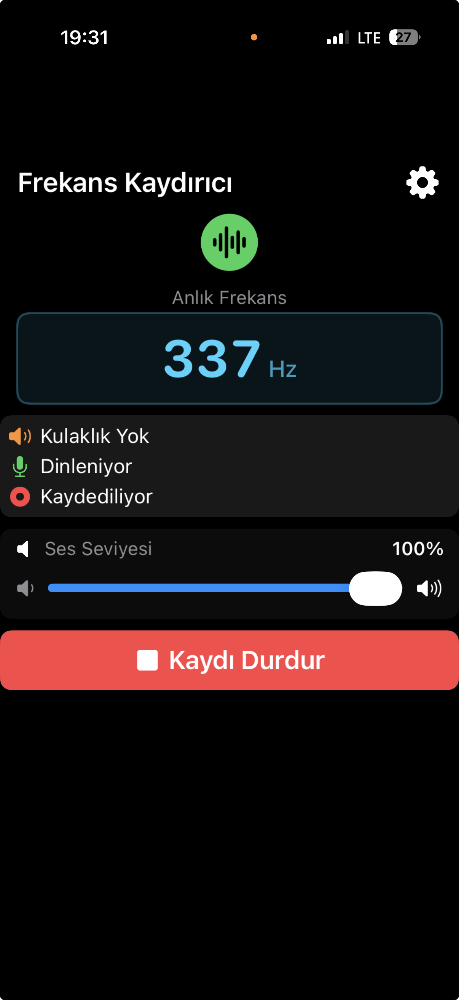

# FrequencyShifter

**An advanced frequency shifting application for iPhone that makes ultrasonic sounds audible and can be used as a hearing aid device.**



## Overview

FrequencyShifter is a real-time audio processing application designed for iPhone 16 Pro that shifts high-frequency sounds (above 10kHz) down to the audible range. This makes it possible to hear sounds that are normally inaudible to the human ear, such as:

- Ultrasonic sensors and devices
- High-pitched electronic equipment
- Bat echolocation calls
- Other ultrasonic phenomena

**The app can also function as a hearing aid device** by amplifying and shifting frequencies to compensate for high-frequency hearing loss.

## Key Features

### 🎵 Real-Time Audio Processing
- **Hybrid Processing Engine**: Combines AVAudioEngine with AVAudioUnitTimePitch for optimal performance
- **FFT-based Frequency Analysis**: Real-time dominant frequency detection with 1-2 Hz precision
- **Adjustable Frequency Threshold**: Configurable between 5-15 kHz (default: 10 kHz)
- **Pitch Shifting**: -1200 cents (one octave down) for high frequencies
- **Low Latency**: ~85ms processing delay (4096 frames @ 48kHz)

### 🎧 Multiple Audio Modes
1. **Real-Time Mode** (Bluetooth/Headphones Connected)
   - Live audio processing and playback
   - Continuous frequency monitoring
   - Suitable for hearing aid use
   
2. **Recording Mode** (No Bluetooth/Headphones)
   - Records processed audio for later playback
   - Playback through iPhone speaker
   - Review and analyze captured sounds

### 📊 Advanced Frequency Analysis
- **FFT Processing**: 4096-sample window with Hamming window
- **Parabolic Interpolation**: Sub-bin frequency estimation
- **Real-time Display**: Shows current dominant frequency in Hz or kHz
- **Noise Threshold**: 0.001 to prevent false readings in silence

### 🔧 Customizable Settings
- **Frequency Threshold**: 5-15 kHz range
- **Lower Frequency Cutoff**: 10-1000 Hz
- **Upper Frequency Cutoff**: 10-40 kHz
- **Volume Control**: 0-100% adjustable output level
- **Persistent Settings**: All preferences saved with UserDefaults

### 🔊 Audio Routing
- **Automatic Detection**: Recognizes Bluetooth speakers/headphones
- **Smart Session Management**: 
  - Bluetooth connected: `.playback` category
  - No Bluetooth: `.playAndRecord` with speaker override
- **Route Change Handling**: Seamless transitions between audio outputs

### 💾 Recording & Playback
- **Buffer-based Recording**: Efficient memory management
- **Hybrid Playback**: Same processing pipeline as real-time mode
- **Delete Function**: Clear recordings when done

## Use as a Hearing Aid

FrequencyShifter can effectively function as a hearing aid device for people with high-frequency hearing loss:

### Benefits:
- **Frequency Compensation**: Shifts inaudible high frequencies to audible ranges
- **Real-time Processing**: Low-latency audio suitable for conversations
- **Customizable**: Adjust threshold and frequency ranges to match specific hearing profiles
- **Bluetooth Support**: Works with hearing aid-compatible Bluetooth devices
- **Volume Control**: Fine-tune output level for comfort

### Recommended Settings for Hearing Aid Use:
1. Connect Bluetooth headphones or hearing aid devices
2. Set frequency threshold to match your hearing loss profile (typically 8-12 kHz)
3. Adjust volume to comfortable level (50-70%)
4. Keep app running in real-time mode

**Note**: While this app can assist with hearing, it is not a certified medical device. Consult with an audiologist for professional hearing assessment and treatment.

## Technical Architecture

### Audio Signal Flow

**Real-Time Mode:**
```
Microphone Input → Tap Node (FFT Analysis) →
  ├─ Low Path  → LowPass Filter (threshold) → Mixer
  └─ High Path → HighPass Filter (threshold) → Pitch (-1200¢) → Mixer
                                                                    ↓
                                                    Output (Bluetooth/Speaker)
```

**Recording Mode:**
```
Microphone → Tap Node (FFT + Buffer Recording) → Stop
Playback: Buffer → Hybrid Processing → Speaker Output
```

### Core Components

**AudioEngine.swift**
- AVAudioEngine management
- Real-time audio processing
- FFT frequency analysis
- Recording/playback control
- Bluetooth routing
- UserDefaults persistence

**ContentView.swift**
- Main user interface
- Real-time frequency display
- Audio controls (Start/Stop/Record/Play)
- Volume slider
- Status indicators

**SettingsView.swift**
- Frequency threshold adjustment
- Lower/upper frequency limits
- Reset to defaults

## Technical Specifications

| Specification | Value |
|--------------|-------|
| Sample Rate | 48,000 Hz |
| Buffer Size | 4096 frames |
| Latency | ~85 ms |
| FFT Window | 4096 samples (Hamming) |
| Frequency Resolution | 11.7 Hz per bin |
| Pitch Shift | -1200 cents (1 octave) |
| Frequency Range | 10 Hz - 40 kHz |
| Default Threshold | 10 kHz |

## Installation

### Requirements
- iPhone 16 Pro or later
- iOS 17.0+
- Xcode 15.0+
- Swift 5.9+

### Build Instructions

1. Clone the repository:
```bash
git clone https://github.com/yourusername/FrequencyShifter.git
cd FrequencyShifter
```

2. Open in Xcode:
```bash
open FrequencyShifter.xcodeproj
```

3. Configure signing:
   - Select your development team
   - Update bundle identifier if needed

4. Build and run on your iPhone 16 Pro

### Permissions

The app requires microphone permission. Add to `Info.plist`:
```xml
<key>NSMicrophoneUsageDescription</key>
<string>FrequencyShifter needs microphone access to process and shift audio frequencies in real-time.</string>
```

## Usage Guide

### Basic Operation

1. **Connect Bluetooth Device** (Optional but Recommended)
   - For hearing aid use: Connect your Bluetooth headphones or hearing aid devices
   - For recording: No Bluetooth needed

2. **Start Processing**
   - Tap "Başlat" (Start) to begin real-time processing
   - The dominant frequency will be displayed in the cyan box
   - Green icon indicates active processing

3. **Adjust Volume**
   - Use the "Ses Seviyesi" (Volume) slider
   - Range: 0-100%

4. **Recording Mode** (No Bluetooth)
   - Tap "Kayda Başla" (Start Recording)
   - Record ultrasonic or high-frequency sounds
   - Tap "Kaydı Durdur" (Stop Recording)
   - Play back with "Dinle" (Listen)

### Settings Configuration

1. Tap the gear icon (⚙️) in top-right
2. Adjust settings:
   - **Frekans Eşiği** (Frequency Threshold): 5000-15000 Hz
   - **Alt Frekans** (Lower Frequency): 10-1000 Hz
   - **Üst Frekans** (Upper Frequency): 10000-40000 Hz
3. Settings are automatically saved

### Status Indicators

- 🎧 **Kulaklık Bağlı**: Bluetooth/headphones connected
- 🔊 **Kulaklık Yok**: No Bluetooth (speaker mode)
- 🎤 **Dinleniyor**: Actively processing audio
- ⏸️ **Durduruldu**: Processing stopped
- 🔴 **Kaydediliyor**: Recording in progress
- ▶️ **Oynatılıyor**: Playing back recording
- ✓ **Kayıt Hazır**: Recording ready for playback

## FFT Analysis Details

The app uses sophisticated FFT analysis to detect dominant frequencies:

### Algorithm
1. **Window Function**: Hamming window to reduce spectral leakage
2. **FFT Transform**: vDSP_DFT_zop for efficient processing
3. **Magnitude Calculation**: Peak detection in frequency domain
4. **Parabolic Interpolation**: Sub-bin accuracy for precise frequency
5. **Noise Gating**: 0.001 threshold to ignore background noise

### Accuracy
- FFT bin resolution: 11.7 Hz (48000 Hz / 4096 samples)
- Parabolic interpolation: ~1-2 Hz precision
- Update rate: Real-time (per audio buffer)

## Performance Optimization

- **Efficient FFT**: vDSP Accelerate framework
- **Smart Session Management**: Adapts to audio routing
- **Buffer Reuse**: Minimal memory allocation
- **Background Processing**: Non-blocking UI updates
- **Persistent Settings**: Fast app launch with saved preferences

## Known Limitations

1. **Device Specific**: Optimized for iPhone 16 Pro microphone
2. **Latency**: ~85ms delay (acceptable for most use cases)
3. **Frequency Range**: Limited by device microphone capabilities
4. **iOS Restrictions**: Cannot change system volume programmatically
5. **Not Medical Certified**: For hearing aid use, consult professionals

## Future Enhancements

- [ ] Multiple frequency shift modes
- [ ] Customizable pitch shift amounts
- [ ] Spectrum analyzer visualization
- [ ] Recording export/share functionality
- [ ] Noise reduction filters
- [ ] Multi-band processing
- [ ] Presets for different use cases
- [ ] Apple Watch companion app

## Troubleshooting

### No Audio Output
- Check Bluetooth connection
- Verify app permissions
- Restart audio session (stop/start)

### Frequency Display Shows 0 Hz
- Increase ambient noise/signal
- Check microphone is not blocked
- Verify frequency threshold settings

### Bluetooth Not Detected
- Ensure device is paired in iOS Settings
- Reconnect Bluetooth device
- Check device compatibility

### Audio Clipping/Distortion
- Lower output volume
- Reduce input gain
- Check for environmental noise

## Dependencies

- **AVFoundation**: Core audio processing
- **Accelerate**: vDSP FFT functions
- **SwiftUI**: User interface
- **Combine**: Reactive state management

## Contributing

Contributions are welcome! Please:

1. Fork the repository
2. Create a feature branch
3. Make your changes
4. Test thoroughly on device
5. Submit a pull request

## License

MIT License

Copyright (c) 2025 FrequencyShifter

Permission is hereby granted, free of charge, to any person obtaining a copy
of this software and associated documentation files (the "Software"), to deal
in the Software without restriction, including without limitation the rights
to use, copy, modify, merge, publish, distribute, sublicense, and/or sell
copies of the Software, and to permit persons to whom the Software is
furnished to do so, subject to the following conditions:

The above copyright notice and this permission notice shall be included in all
copies or substantial portions of the Software.

THE SOFTWARE IS PROVIDED "AS IS", WITHOUT WARRANTY OF ANY KIND, EXPRESS OR
IMPLIED, INCLUDING BUT NOT LIMITED TO THE WARRANTIES OF MERCHANTABILITY,
FITNESS FOR A PARTICULAR PURPOSE AND NONINFRINGEMENT. IN NO EVENT SHALL THE
AUTHORS OR COPYRIGHT HOLDERS BE LIABLE FOR ANY CLAIM, DAMAGES OR OTHER
LIABILITY, WHETHER IN AN ACTION OF CONTRACT, TORT OR OTHERWISE, ARISING FROM,
OUT OF OR IN CONNECTION WITH THE SOFTWARE OR THE USE OR OTHER DEALINGS IN THE
SOFTWARE.

## Acknowledgments

- Developed for ultrasonic sound detection and hearing assistance
- Uses Apple's Accelerate framework for efficient DSP
- Inspired by the need to make high-frequency sounds accessible

## Contact

For questions, suggestions, or issues:
- Open an issue on GitHub
- Email: your.email@example.com

---

**⚠️ Medical Disclaimer**: This application is not a certified medical device. While it can assist with hearing high-frequency sounds, it should not replace professional hearing aids or medical consultation. Always consult with qualified healthcare professionals for hearing-related concerns.

**Made with ❤️ for the hearing-impaired community and ultrasonic enthusiasts**
